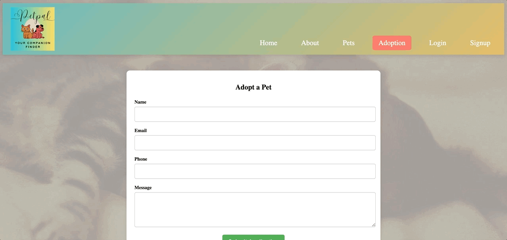

# PetPal-Your Companion Finder


## Table of Contents

- [Technologies Used](#technologies-used)
- [Description](#description)
- [Features](#features)
- [Installation](#installation)
- [Usage](#usage)
- [Screenshots](#screenshots)
- [License](#license)
- [Contribution](#contributors)
- [Questions](#questions)

## Technologies Used

- Frontend: 
    -   React.js
    -   TypeScript
    -   Vite
    -   CSS

- Backend:
    -   Python with Flask
    -   JWT Authentication
    -   MongoDB with Mongoose (for user and pet data)

- Deployment: 
    -   Render (Full-Stack development)

## Description

PetPal is a web-based pet adoption platform designed to connect pet seekers with pets in need of a home. The platform allows users to browse available pets, create accounts, manage their favorite pets, and submit adoption applications. Built with modern technologies, PetPal ensures a user-friendly experience, helping to facilitate meaningful connections between pets and their future families.

## Features

- User Registration & Login: Users can sign up, log in, and authenticate using JWT.
- Pet Listings: Browse a wide range of available pets for adoption.
- Favorites: Save your favorite pets and apply for adoption later.
- Adoption Requests: Submit adoption applications for pets you are interested in.
- Responsive Design: Fully responsive UI for optimal user experience across devices.

## Installation

1. Clone the repository: Open a terminal and run the following command to clone the project:

    ```
    git clone https://github.com/your-username/petpal.git
    ```

2. Navigate to the project directory:

    ```
    cd petpal
    ```

3. Install dependencies:

    ```
    npm install
    ```

4. Set up the environmental variables in the server directory:

    ```
    MONNGODB_URI='your_mongodb_connection_string'
    JWT_SECRET='your_jwt_secret_key'
    ```

6. Build the dist folder:

    ```
    npm run client:build
    ```

7. Run the development server: Start both the client and server applications:

    ```
    npm run start:dev
    ```

PetPal should now be running locally at http://localhost:3000.

## Usage

Follow these steps to use the PetPal application:

1. ### Browse Available Pets
    Navigate to the Pets page to view a list of pets available for adoption. Each listing includes details about the pet, such as its name, age, breed, and a brief description.

2. ### Create an Account
    Sign up using the Sign Up page to create a new account. You can log in to your account afterward to access additional features.

3. ### Manage Favorites
    While browsing pets, click the Favorite button to save pets you're interested in. Access all your favorited pets on the Favorites page.

4. ### Submit Adoption Applications
    From a pet's detailed page, click the Adopt button to navigate to the adoption form. Fill in your details and submit your application for review.

5. ### User Dashboard
    Once logged in, manage your account and view the pets you've interacted with.

## Screenshots

The following animation shows how the Homepage and About page appears:


The following animation show the Adoption, Login, and Signup pages:



The following animation shows how the Pets page appears once the user is logged in:


The following animation shows how the user can save pets, view in Favorites, and remove from Favorites:


The following animation shows the Logout functionality and return the user back to Homepage:


Link to the deployed site:

https://petpal-wtuj.onrender.com/

## License

MIT License

Copyright (c) 2024 ASgithub11

Permission is hereby granted, free of charge, to any person obtaining a copy
of this software and associated documentation files (the "Software"), to deal
in the Software without restriction, including without limitation the rights
to use, copy, modify, merge, publish, distribute, sublicense, and/or sell
copies of the Software, and to permit persons to whom the Software is
furnished to do so, subject to the following conditions:

The above copyright notice and this permission notice shall be included in all
copies or substantial portions of the Software.

THE SOFTWARE IS PROVIDED "AS IS", WITHOUT WARRANTY OF ANY KIND, EXPRESS OR
IMPLIED, INCLUDING BUT NOT LIMITED TO THE WARRANTIES OF MERCHANTABILITY,
FITNESS FOR A PARTICULAR PURPOSE AND NONINFRINGEMENT. IN NO EVENT SHALL THE
AUTHORS OR COPYRIGHT HOLDERS BE LIABLE FOR ANY CLAIM, DAMAGES OR OTHER
LIABILITY, WHETHER IN AN ACTION OF CONTRACT, TORT OR OTHERWISE, ARISING FROM,
OUT OF OR IN CONNECTION WITH THE SOFTWARE OR THE USE OR OTHER DEALINGS IN THE
SOFTWARE.

## Contributors

- Kaleb Boothe

- Kayla Hebertson

- Lindsay

## Questions

If you have any questions, reach me on Github: https://github.com/ASgithub11

or email me here at aishasiddiqa151@gmail.com
